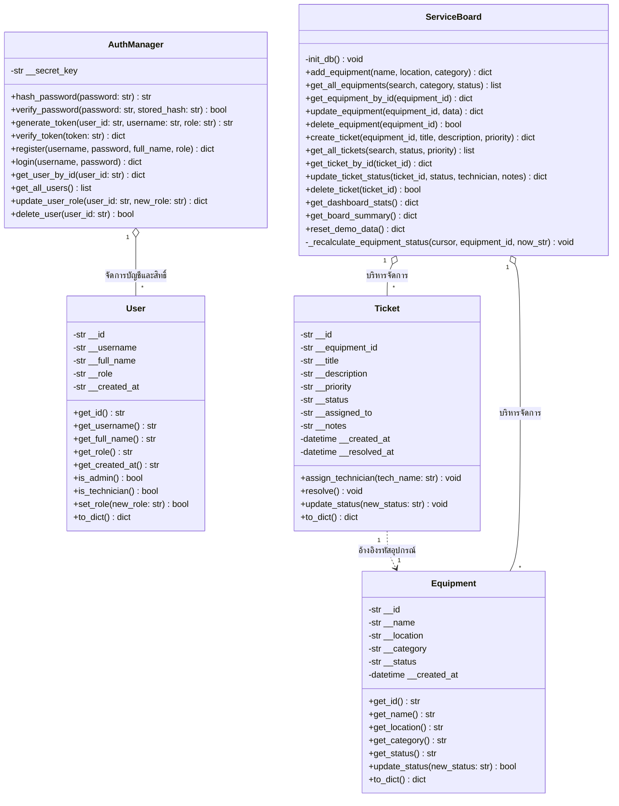
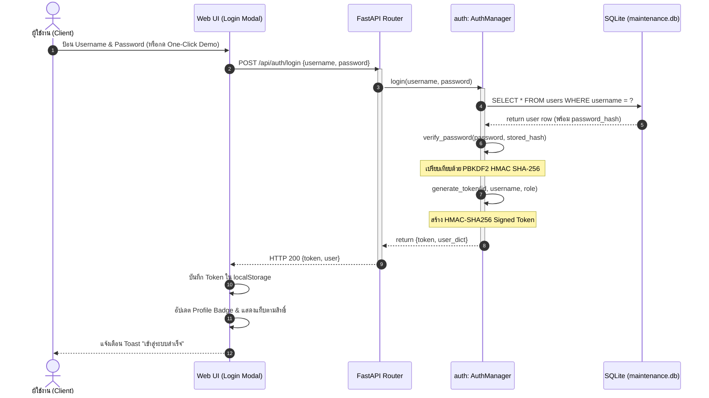
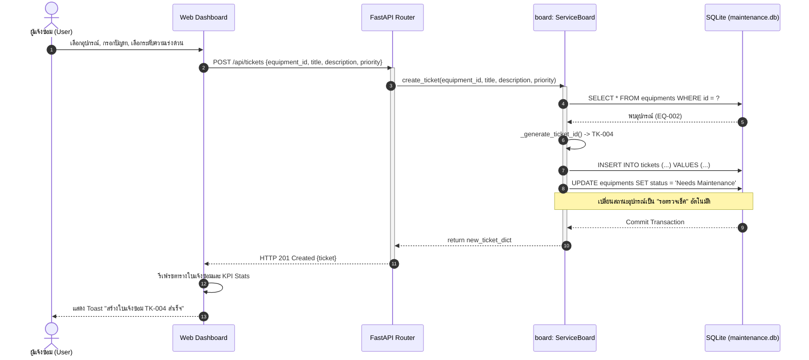
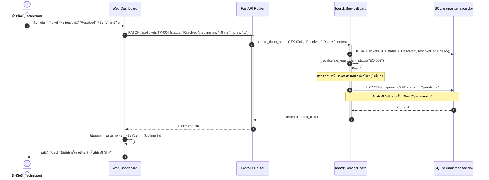
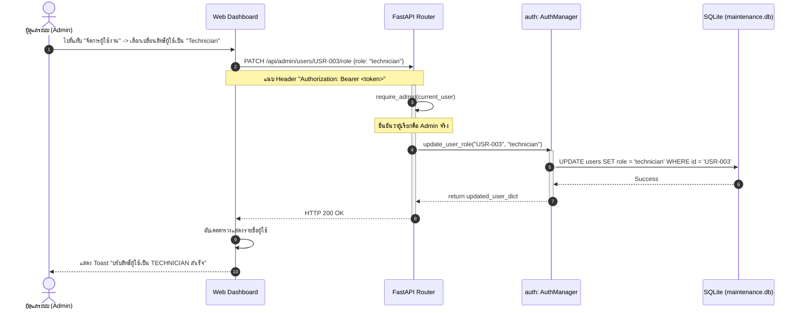

# 🛠️ Quick Maintenance Tracker (Enterprise Edition)

> **ระบบบริหารจัดการและติดตามงานซ่อมบำรุงอุปกรณ์อัจฉริยะ** พัฒนาด้วยภาษา **Python (FastAPI)** และ **Vanilla Web Stack (HTML5, CSS3, Modern JavaScript)** โดยยึดหลักการออกแบบเชิงวัตถุ (**Object-Oriented Programming - OOP**) อย่างเคร่งครัด พร้อมระบบรักษาความปลอดภัย **Authentication**, สิทธิ์ผู้ใช้งานแบบหลายระดับ (**Role-Based Access Control - RBAC**), และหน้าจอแสดงผล **Modern Dashboard รองรับทั้งธีมขาว (Light) และธีมดำ (Dark)**

---

## 📑 สารบัญ (Table of Contents)
1. [จุดเด่นและคุณสมบัติสำคัญ](#-จุดเด่นและคุณสมบัติสำคัญ)
2. [การแบ่งบทบาทหน้าที่ในทีม (2 คน)](#-การแบ่งบทบาทหน้าที่ในทีม-2-คน)
3. [ผังระบบและสถาปัตยกรรมเชิงวัตถุ (System & OOP Diagrams)](#-ผังระบบและสถาปัตยกรรมเชิงวัตถุ)
   - [1. System Flowchart (ลำดับการทำงานภาพรวม)](#1-system-flowchart-ลำดับการทำงานภาพรวม)
   - [2. Class Diagram (โครงสร้างเชิงวัตถุครบทุกคลาส)](#2-class-diagram-โครงสร้างเชิงวัตถุ)
   - [3. Sequence Diagram: ระบบยืนยันตัวตน (Authentication Flow)](#3-sequence-diagram-ระบบยืนยันตัวตน-authentication-flow)
   - [4. Sequence Diagram: การเปิดใบแจ้งซ่อมและอัปเดตสถานะอุปกรณ์](#4-sequence-diagram-การเปิดใบแจ้งซ่อมและอัปเดตสถานะอุปกรณ์)
   - [5. Sequence Diagram: การปิดเคสซ่อมและคืนสถานะอุปกรณ์](#5-sequence-diagram-การปิดเคสซ่อมและคืนสถานะอุปกรณ์)
   - [6. Sequence Diagram: การบริหารจัดการสิทธิ์ผู้ใช้โดย Admin](#6-sequence-diagram-การบริหารจัดการสิทธิ์ผู้ใช้โดย-admin)
4. [รวมคำสั่งทั้งหมดที่ใช้ในโปรเจกต์นี้ (All Commands Guide)](#-รวมคำสั่งทั้งหมดที่ใช้ในโปรเจกต์นี้)
5. [บัญชีผู้ใช้สำหรับทดสอบระบบ (Default Test Accounts)](#-บัญชีผู้ใช้สำหรับทดสอบระบบ)
6. [เอกสาร RESTful API Endpoints](#-เอกสาร-restful-api-endpoints)
7. [โครงสร้างไฟล์และไดเรกทอรี (Project Structure)](#-โครงสร้างไฟล์และไดเรกทอรี)
8. [คู่มือการใช้งานตามบทบาท (User Guide by Role)](#-คู่มือการใช้งานตามบทบาท)

---

## 🌟 จุดเด่นและคุณสมบัติสำคัญ

1. **Object-Oriented Architecture (OOP)**:
   - นำหลักการ **Encapsulation** มาใช้อย่างสมบูรณ์ มีการซ่อนแอตทริบิวต์เป็น Private และเข้าถึงผ่าน Getter/Setter
   - แยกหน้าที่ความรับผิดชอบอย่างชัดเจนตามหลัก **Single Responsibility Principle (SRP)**
2. **Modern Dashboard & Theme Switcher**:
   - หน้าจอใช้งานแบบ **Modern SaaS** สบายตา รองรับทั้ง **ธีมขาว (Light Mode - ค่าเริ่มต้น)** และ **ธีมดำ (Dark Mode)**
   - สลับธีมได้ทันทีด้วยปุ่ม Sun/Moon พร้อมบันทึกสถานะลงใน `localStorage`
3. **Multi-Role Authentication & Access Control (RBAC)**:
   - รองรับ 3 บทบาทหลัก: **Admin** (ผู้ดูแลระบบ), **Technician** (ช่างซ่อมบำรุง), และ **User** (ผู้ใช้งานทั่วไป)
   - ระบบแฮชรหัสผ่านด้วย **PBKDF2 HMAC SHA-256** (ความปลอดภัยมาตรฐานสากล ไม่ต้องติดตั้งไลบรารีภายนอกเพิ่ม)
   - ระบบออกและตรวจสอบ **HMAC-SHA256 Signed Token** 
   - มีปุ่ม **One-Click Quick Login** สำหรับทดสอบและสาธิต Demo สะดวกสบาย
4. **Real-time Equipment & Ticket Synchronization**:
   - เมื่อมีการแจ้งซ่อม สถานะของอุปกรณ์จะเปลี่ยนเป็น *Needs Maintenance* หรือ *Under Repair* อัตโนมัติ
   - เมื่อช่างแก้ไขจนเสร็จสิ้น (*Resolved / Closed*) สถานะอุปกรณ์จะถูกคืนค่ากลับเป็น *Operational (ปกติ)* โดยอัตโนมัติ
5. **Interactive Controls & Toast Notifications**:
   - มี Popup Modals สวยงามแทนการใช้ Prompt แบบดั้งเดิม
   - ระบบแจ้งเตือน Floating Toast มุมขวาบน แจ้งสถานะสำเร็จหรือข้อผิดพลาด

---

## 👥 การแบ่งบทบาทหน้าที่ในทีม (2 คน)

| สมาชิก | คลาส / โมดูลที่รับผิดชอบ | หน้าที่หลักเชิงเทคนิค (Responsibilities) |
| :--- | :--- | :--- |
| **คนที่ 1** | **`Equipment`** | • ออกแบบและพัฒนาคลาส `Equipment` (ใน `backend/equipment.py`) จัดการข้อมูลอุปกรณ์ รหัส สถานที่ติดตั้ง หมวดหมู่<br>• นำหลัก **Encapsulation** มาใช้เพื่อปกป้องข้อมูลคุณลักษณะเป็น Private และควบคุมการเปลี่ยนสถานะการทำงาน (`Operational`, `Needs Maintenance`, `Under Repair`) พร้อม Data Validation ก่อนบันทึก |
| **คนที่ 2** | **`Ticket`** | • ออกแบบและพัฒนาคลาส `Ticket` / `MaintenanceTicket` (ใน `backend/ticket.py`) จัดการวงจรชีวิตของใบแจ้งซ่อมทั้งหมด<br>• จัดการข้อมูลอาการเสีย กำหนดระดับความเร่งด่วน (`Low`, `Medium`, `High`, `Urgent`), บันทึกผู้แจ้งซ่อม (`created_by`), มอบหมายงานช่าง (`technician`), ควบคุมสถานะ (`Open`, `In Progress`, `Resolved`, `Closed`), และบันทึกผลการซ่อมแซม (`resolution_notes`) |
| **ทำงานร่วมกัน** | **`ServiceBoard` & ระบบส่วนกลาง (User/Auth, FastAPI, Frontend)** | • **คลาสส่วนกลาง `ServiceBoard`**: ร่วมกันออกแบบและพัฒนาคลาส Hub ศูนย์กลางเพื่อเชื่อมโยง `Equipment` (คนที่ 1) และ `Ticket` (คนที่ 2) เข้าด้วยกัน ซิงค์สถานะอุปกรณ์อัตโนมัติตาม Ticket ที่ค้างอยู่ และคำนวณสถิติภาพรวม (KPI System Health & Uptime %)<br>• **ระบบยืนยันตัวตน & ความปลอดภัย**: ร่วมกันพัฒนาคลาส `User` และ `AuthManager` (การลงทะเบียน, เข้าสู่ระบบ, แฮชรหัสผ่าน PBKDF2 HMAC SHA-256, และระบบสิทธิ์ RBAC 3 ระดับ)<br>• **FastAPI & Frontend**: ร่วมกันเชื่อมโยง RESTful API Endpoints เข้ากับ Modern UI Dashboard (รองรับทั้งธีมขาว/ดำ, Modals, Toasts) และการทดสอบระบบแบบ End-to-End |

---

## 📐 ผังระบบและสถาปัตยกรรมเชิงวัตถุ

### 1. System Flowchart (ลำดับการทำงานภาพรวม)

```mermaid
flowchart TD
    Start([🚀 เริ่มต้นใช้งาน]) --> CheckAuth{เข้าสู่ระบบหรือยัง?}
    
    CheckAuth -->|ยังไม่ได้ล็อกอิน| GuestView[ดูสถิติภาพรวม / สลับธีมขาว-ดำ]
    GuestView --> ActionLogin{ต้องการทำรายการ?}
    ActionLogin -->|เข้าสู่ระบบ| DoLogin[กรอก Username/Password หรือ One-Click Login]
    ActionLogin -->|สมัครสมาชิก| DoReg[ลงทะเบียนผู้ใช้ใหม่]
    DoReg --> DoLogin
    DoLogin --> IdentifyRole{ตรวจสอบสิทธิ์ (Role)}

    CheckAuth -->|ล็อกอินแล้ว| IdentifyRole

    IdentifyRole -->|User ทั่วไป| UserMenu[1. แจ้งซ่อมอุปกรณ์<br>2. ติดตามสถานะงานของตนเอง<br>3. ดูทะเบียนอุปกรณ์]
    IdentifyRole -->|Technician ช่าง| TechMenu[1. รับงานซ่อม In Progress<br>2. บันทึกผลการซ่อม / มอบหมายงาน<br>3. ปิดเคส Resolved -> อุปกรณ์กลับมาปกติ]
    IdentifyRole -->|Admin ผู้ดูแล| AdminMenu[1. บริหารจัดการผู้ใช้งาน ปรับสิทธิ์/ลบ<br>2. เพิ่ม/แก้ไข/ลบ ทะเบียนอุปกรณ์<br>3. ลบใบแจ้งซ่อม / รีเซ็ต Demo Data]

    UserMenu --> UpdateBoard[ServiceBoard ประมวลผลและอัปเดต SQLite DB]
    TechMenu --> UpdateBoard
    AdminMenu --> UpdateBoard
    UpdateBoard --> RefreshUI[หน้าเว็บอัปเดตข้อมูลและแจ้งเตือน Toast] --> End([สิ้นสุดการทำงาน])
```

---

### 2. Class Diagram (โครงสร้างเชิงวัตถุ)



---

### 3. Sequence Diagram: ระบบยืนยันตัวตน (Authentication Flow)



---

### 4. Sequence Diagram: การเปิดใบแจ้งซ่อมและอัปเดตสถานะอุปกรณ์



---

### 5. Sequence Diagram: การปิดเคสซ่อมและคืนสถานะอุปกรณ์



---

### 6. Sequence Diagram: การบริหารจัดการสิทธิ์ผู้ใช้โดย Admin



---

## 💻 รวมคำสั่งทั้งหมดที่ใช้ในโปรเจกต์นี้

### 1. การเตรียม Virtual Environment

#### 🖥️ สำหรับ Windows (PowerShell / Command Prompt):
```powershell
# 1. สร้าง Virtual Environment ชนิด venv
python -m venv venv

# 2. เปิดใช้งาน venv (PowerShell)
.\venv\Scripts\Activate.ps1

# (หากติด Execution Policy ใน PowerShell ให้สั่ง: Set-ExecutionPolicy -ExecutionPolicy RemoteSigned -Scope Process ก่อน)

# หรือเปิดใช้งาน venv (Command Prompt cmd.exe)
.\venv\Scripts\activate.bat
```

#### 🍎 สำหรับ macOS / Linux:
```bash
# 1. สร้าง Virtual Environment
python3 -m venv venv

# 2. เปิดใช้งาน venv
source venv/bin/activate
```

---

### 2. การติดตั้ง Dependencies

```bash
# อัปเกรด pip ให้เป็นรุ่นล่าสุด
python -m pip install --upgrade pip

# ติดตั้งแพ็กเกจที่ระบุใน requirements.txt
pip install -r requirements.txt
```

*แพ็กเกจหลักใน `requirements.txt`:*
- `fastapi>=0.100.0` (RESTful API Web Framework)
- `uvicorn>=0.20.0` (High-performance ASGI Web Server)
- `pydantic>=2.0` (Data Validation and Settings Management)

---

### 3. การรันเซิร์ฟเวอร์ระบบ (Launch Server)

#### 🚀 วิธีที่ 1: รันด้วยตัวเปิดระบบหลัก (แนะนำ สะดวกที่สุด)
```bash
python main.py
```

#### ⚡ วิธีที่ 2: รันผ่าน Uvicorn Command โดยตรง
```bash
uvicorn backend.app:app --host 0.0.0.0 --port 8000 --reload
```

เมื่อเซิร์ฟเวอร์เริ่มต้นสำเร็จ:
- 🌐 **หน้าเว็บระบบ (Frontend Dashboard)**: [http://127.0.0.1:8000](http://127.0.0.1:8000) หรือ [http://localhost:8000](http://localhost:8000)
- 📚 **เอกสาร Interactive API (Swagger UI)**: [http://127.0.0.1:8000/docs](http://127.0.0.1:8000/docs)
- 📖 **เอกสาร Alternative API (ReDoc)**: [http://127.0.0.1:8000/redoc](http://127.0.0.1:8000/redoc)

---

### 4. คำสั่งทดสอบระบบอัตโนมัติ (Automated Verification Commands)

```bash
# 1. ตรวจสอบเวอร์ชันและการทำงานของ FastAPI
python -c "import fastapi, uvicorn; print('FastAPI Version:', fastapi.__version__)"

# 2. ทดสอบคลาสเชิงวัตถุ Equipment, Ticket, User, AuthManager
python -c "import sys; sys.path.append('backend'); from auth import AuthManager; from service_board import ServiceBoard; print('OOP Classes Loaded Successfully!')"

# 3. ทดสอบการดึงข้อมูลสถิติภาพรวมจากฐานข้อมูล
python -c "import sys; sys.path.append('backend'); from service_board import ServiceBoard; print(ServiceBoard().get_dashboard_stats())"
```
---

## 🔑 บัญชีผู้ใช้สำหรับทดสอบระบบ

ระบบมีข้อมูลบัญชีผู้ใช้เริ่มต้น (**Seed Data**) พร้อมรหัสผ่านที่ผ่านการแฮชแบบ PBKDF2 เรียบร้อยแล้ว:

| Username | Password | ชื่อ - สกุล | บทบาท (Role) | สิทธิ์การเข้าถึง |
| :--- | :--- | :--- | :---: | :--- |
| **`admin`** | `admin123` | ผู้ดูแลระบบ (System Admin) | `admin` | สิทธิ์สูงสุด จัดการผู้ใช้ เพิ่ม/ลบอุปกรณ์ รีเซ็ตระบบ |
| **`technician`** | `tech123` | วิศวกร ธนากร (ช่างเทคนิค) | `technician` | รับงานซ่อม อัปเดตสถานะ ปิดเคส และบันทึกผล |
| **`user`** | `user123` | สมชาย ใจดี (พนักงานทั่วไป) | `user` | แจ้งซ่อมและติดตามสถานะงาน |

> 💡 **Tip**: เมื่อกดเปิดหน้าต่าง **"เข้าสู่ระบบ"** ในหน้าเว็บ จะมีปุ่ม **One-Click Demo Login** ให้คลิกเพื่อเข้าสู่ระบบตามสิทธิ์ที่ต้องการได้ทันทีโดยไม่ต้องพิมพ์!

---

## 🌐 เอกสาร RESTful API Endpoints

### 1. หมวดความปลอดภัยและการยืนยันตัวตน (Authentication)
| Method | Endpoint | สิทธิ์ | คำอธิบาย |
| :--- | :--- | :---: | :--- |
| `POST` | `/api/auth/register` | Public | ลงทะเบียนผู้ใช้งานใหม่ (ระบุ username, password, full_name, role) |
| `POST` | `/api/auth/login` | Public | เข้าสู่ระบบ และรับ Bearer Token |
| `GET` | `/api/auth/me` | Authenticated | ตรวจสอบข้อมูลส่วนตัวของผู้ใช้ปัจจุบันที่ล็อกอินอยู่ |

### 2. หมวดการบริหารจัดการผู้ใช้ (Admin Only)
| Method | Endpoint | สิทธิ์ | คำอธิบาย |
| :--- | :--- | :---: | :--- |
| `GET` | `/api/admin/users` | Admin | ดึงรายชื่อผู้ใช้งานทั้งหมดในระบบ |
| `PATCH` | `/api/admin/users/{user_id}/role` | Admin | ปรับเปลี่ยนสิทธิ์ผู้ใช้ (`admin`, `technician`, `user`) |
| `DELETE` | `/api/admin/users/{user_id}` | Admin | ลบบัญชีผู้ใช้งานออกจากระบบ |

### 3. หมวดกระดานสรุปและระบบ (Dashboard & System)
| Method | Endpoint | สิทธิ์ | คำอธิบาย |
| :--- | :--- | :---: | :--- |
| `GET` | `/api/health` | Public | ตรวจสอบสถานะการเชื่อมต่อของระบบ (Health Check) |
| `GET` | `/api/stats` | Public | ดึงตัวเลขสถิติ KPI (Uptime %, จำนวนอุปกรณ์, เคสด่วน) |
| `GET` | `/api/board` | Public | ดึงข้อมูลภาพรวม (Stats + Equipments + Tickets) |
| `POST` | `/api/reset-demo` | Public / Admin | รีเซ็ตฐานข้อมูลและสร้างข้อมูลตัวอย่างสำหรับการนำเสนอ |

### 4. หมวดทะเบียนอุปกรณ์ (Equipments)
| Method | Endpoint | สิทธิ์ | คำอธิบาย |
| :--- | :--- | :---: | :--- |
| `GET` | `/api/equipments` | Public | ดึงรายการอุปกรณ์ทั้งหมด (รองรับ Query: search, category, status) |
| `GET` | `/api/equipments/{id}` | Public | ดูรายละเอียดอุปกรณ์เดี่ยว พร้อมประวัติการซ่อมบำรุงทั้งหมด |
| `POST` | `/api/equipments` | User/Admin | ลงทะเบียนอุปกรณ์ใหม่เข้าระบบ |
| `PUT` | `/api/equipments/{id}` | Admin | แก้ไขข้อมูลหรือสถานที่ติดตั้งของอุปกรณ์ |
| `DELETE` | `/api/equipments/{id}` | Admin | ลบอุปกรณ์และประวัติการซ่อมที่เกี่ยวข้อง |

### 5. หมวดใบแจ้งซ่อม (Tickets)
| Method | Endpoint | สิทธิ์ | คำอธิบาย |
| :--- | :--- | :---: | :--- |
| `GET` | `/api/tickets` | Public | ค้นหาและดึงรายการใบแจ้งซ่อมทั้งหมด |
| `GET` | `/api/tickets/{id}` | Public | ดูรายละเอียดใบแจ้งซ่อมตามรหัสที่ระบุ |
| `POST` | `/api/tickets` | User/Admin | เปิดใบแจ้งซ่อมใหม่ (ระบบจะปรับสถานะอุปกรณ์ให้อัตโนมัติ) |
| `PATCH` | `/api/tickets/{id}` | Tech/Admin | อัปเดตสถานะงานซ่อม, มอบหมายช่าง, บันทึกผลการซ่อม |
| `DELETE` | `/api/tickets/{id}` | Admin | ลบ/ยกเลิกใบแจ้งซ่อม (ระบบจะคำนวณสถานะอุปกรณ์ใหม่) |

---

## 📂 โครงสร้างไฟล์และไดเรกทอรี

```text
Quick-Maintenance-Tracker/
│
├── main.py                      # จุดเริ่มต้นการรันเซิร์ฟเวอร์หลัก (Entry Point)
├── requirements.txt             # รายการไลบรารี Python ที่ต้องติดตั้ง
├── README.md                    # คู่มือสถาปัตยกรรมและการใช้งานฉบับสมบูรณ์
│
├── backend/                     # โค้ดส่วน Backend และสถาปัตยกรรม OOP
│   ├── app.py                   # FastAPI Application, Route Controller & Middleware
│   ├── auth.py                  # คลาส AuthManager จัดการ Token, Hash รหัสผ่าน และสิทธิ์
│   ├── user.py                  # คลาส User (OOP)
│   ├── equipment.py             # คลาส Equipment (OOP)
│   ├── ticket.py                # คลาส MaintenanceTicket (OOP)
│   ├── service_board.py         # คลาส ServiceBoard เชื่อมโยงระบบและคำนวณสถานะ
│   ├── database.py              # SQLite Database Handler & Data Seeding
│   ├── models.py                # Pydantic Data Validation Schemas
│   └── maintenance.db           # ฐานข้อมูล SQLite เก็บข้อมูลจริง
│
└── frontend/                    # โค้ดส่วน Frontend (Modern UI)
    ├── index.html               # โครงสร้างหน้าเว็บ Semantic HTML5, Modals, Tabs
    ├── style.css                # ดีไซน์ระบบ ธีมขาว/ดำ (Light/Dark Variables), Responsive
    └── app.js                   # ตัวควบคุมฝั่ง Client, จัดการ State, Theme, API & RBAC
```

---

## 📖 คู่มือการใช้งานตามบทบาท

### 1. การใช้งานสำหรับผู้ใช้ทั่วไป (Role: User)
1. กดปุ่ม **"เข้าสู่ระบบ"** แล้วเลือก Quick Login **User** (หรือกรอก `user` / `user123`)
2. เมื่อพบอุปกรณ์ชำรุด ให้กดปุ่ม **"+ แจ้งซ่อมใหม่"**
3. เลือกอุปกรณ์จาก Dropdown, กรอกอาการเสีย และเลือกระดับความเร่งด่วน
4. ติดตามสถานะงานซ่อมของตนเองได้จากตาราง **"ใบแจ้งซ่อม"**

### 2. การใช้งานสำหรับช่างซ่อมบำรุง (Role: Technician)
1. เข้าสู่ระบบด้วย Quick Login **Technician** (หรือกรอก `technician` / `tech123`)
2. เมื่อเริ่มลงมือซ่อม ให้กดปุ่ม **"จัดการ"** ที่ใบแจ้งซ่อมนั้นๆ
3. ปรับสถานะเป็น `In Progress` และใส่ชื่อตนเองเป็นผู้รับผิดชอบ
4. เมื่อซ่อมเสร็จสิ้น ให้เลือกสถานะเป็น `Resolved` พร้อมบันทึกรายละเอียดอะไหล่ที่เปลี่ยน
5. ระบบจะคำนวณและปรับสถานะอุปกรณ์ในทะเบียนให้กลับมาเป็น `Operational (ปกติ)` ทันที

### 3. การใช้งานสำหรับผู้ดูแลระบบ (Role: Admin)
1. เข้าสู่ระบบด้วย Quick Login **Admin** (หรือกรอก `admin` / `admin123`)
2. สามารถเข้าถึงแท็บ **"จัดการผู้ใช้งาน"** เพื่อดูรายชื่อสมาชิก และปรับเปลี่ยนบทบาทผู้ใช้
3. สามารถเพิ่มอุปกรณ์ใหม่เข้าระบบผ่านแท็บ **"ทะเบียนอุปกรณ์"** หรือสั่งลบอุปกรณ์ที่เลิกใช้งาน
4. สามารถกดปุ่ม **"รีเซ็ต Demo"** เพื่อคืนค่าข้อมูลระบบกลับสู่ค่าเริ่มต้นสำหรับการทดสอบนำเสนอ

---

